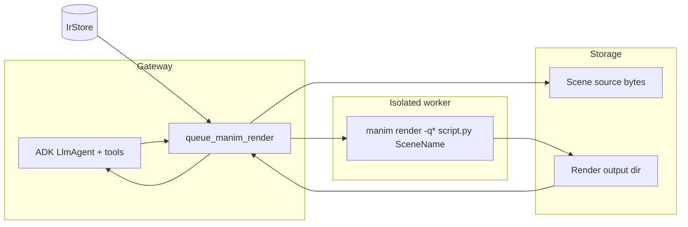

# Manim render pipeline — implementation spec

This document describes how to **fully implement** the end-to-end **Manim Community Edition** path that the repo currently **does not wire up** in the gateway: from a **learner or LLM-produced scene** to a **rendered video artifact**, integrated with **IR hints**, **sandboxed execution**, and optional **HTTP delivery**.

For **ManiBench** (training data, metrics, `manim render` in eval), see [MANIBENCH_RUNBOOK.md](MANIBENCH_RUNBOOK.md) and [training/manibench/README.md](../training/manibench/README.md). This doc focuses on **product/gateway** integration.

**AutoManim** (lecture Markdown → ADK `LlmAgent` planner/codegen → local or Docker `manim` render) is documented in [AUTOMANIM.md](AUTOMANIM.md) and shares render semantics via `educlaw.viz`.

---

## 1. What exists today (gaps)

### 1.1 Agent tool is a stub

`queue_manim_render` returns a placeholder and does not execute Manim or persist output:

```10:18:src/educlaw/agent/tools/manim_tool.py
def build(deps: AgentDeps) -> Any:
    async def queue_manim_render(scene_hint: str, ir_node_id: str) -> dict[str, str]:
        """Queue a Manim render in the sandbox (stub — wire Docker manim image)."""
        return {
            "status": "queued",
            "scene_hint": scene_hint,
            "ir_node_id": ir_node_id,
            "note": "Implement Docker educlaw/manim:latest worker",
        }
```

### 1.2 Gateway uses `NullSandbox`

The production agent receives a **no-op sandbox**; `DockerSandbox` exists but is not selected in the app lifespan:

```52:55:src/educlaw/gateway/app.py
    from educlaw.sandbox.null_sandbox import NullSandbox

    sandbox: Any = NullSandbox()
```

The **Sandbox** contract you must satisfy for real execution is:

```16:24:src/educlaw/sandbox/contract.py
class Sandbox(Protocol):
    async def exec(
        self,
        argv: list[str],
        *,
        cwd: str = "/work",
        timeout: timedelta = timedelta(seconds=30),
        stdin: bytes | None = None,
    ) -> ExecResult: ...

    async def write_file(self, path: str, data: bytes) -> None: ...
```

### 1.3 IR already models Manim hints

Course nodes can carry optional `manim` metadata (scene name + hint strings):

```24:38:src/educlaw/ir/schema.py
class IrManimHint(BaseModel):
    scene: str
    hints: list[str] = Field(default_factory=list)
...
class IrNode(BaseModel):
    ...
    manim: IrManimHint | None = None
```

The pipeline should **read** this when `ir_node_id` is passed to the tool.

### 1.4 Docker image stub

A minimal image installs Manim CE but is not used as a worker yet:

```1:6:docker/manim.Dockerfile
# Manim worker (stub — pin manim-community + ffmpeg in production)
FROM python:3.11-slim-bookworm
RUN pip install --no-cache-dir manim
WORKDIR /work
CMD ["manim", "--version"]
```

### 1.5 Roadmap entry

Planned work is noted in [ROADMAP.md](ROADMAP.md) under “Manim pipeline”.

---

## 2. Target behavior

1. **Input**: Full **Manim CE** Python source (or a path/ID to stored source), a **`Scene` class name** (or parse it), optional **`ir_node_id`** to merge IR `manim` hints for validation/logging.
2. **Execute**: Run **`manim render`** in an **isolated** environment (container or strong sandbox) with **CPU/time/memory** limits and **no network** by default.
3. **Output**: **Video file** (and sidecar `media` tree per Manim defaults) **stored** under a configurable directory (e.g. `data_dir/manim_renders/{job_id}/`), with a **stable URL or file path** returned to the tool caller.
4. **Observability**: Return **exit code**, **stdout/stderr** tail (already shaped by `ExecResult` limits in `DockerSandbox`).

**External references (Manim CE):**

- [Manim documentation — `manim render`](https://docs.manim.community/en/stable/guides/deep_dive.html) (CLI and rendering pipeline; also see the official CLI help for your installed version).
- [Manim Community Edition installation](https://docs.manim.community/en/stable/installation.html) (system dependencies: **ffmpeg**, LaTeX optional for `Tex`).

---

## 3. Recommended architecture



**Design choice:** Either (A) run `manim` **inside** the existing `DockerSandbox` with image `educlaw/manim:latest`, or (B) launch a **one-shot** container per job (`docker run --rm ... educlaw/manim:latest manim render ...`). (B) is often simpler to reason about (no long-lived `sleep infinity` container) and matches “job queue” language in the roadmap. `DockerSandbox` as implemented today is **long-lived**; see [docker_sandbox.py](../src/educlaw/sandbox/docker_sandbox.py).

---

## 4. Implementation phases

### Phase A — Harden the worker image

- **Pin** Python, `manim`, and **ffmpeg** in [docker/manim.Dockerfile](../docker/manim.Dockerfile) (multi-stage or `apt-get install ffmpeg` in the same layer as `pip install manim`).
- **Non-root** user, **read-only** root filesystem except a **writable** `/work` (align with [DockerSandbox](../src/educlaw/sandbox/docker_sandbox.py) `tmpfs` pattern or K8s `emptyDir` later).
- **Build**: `docker build -f docker/manim.Dockerfile -t educlaw/manim:latest .` (already referenced in [DEVELOPERS.md](DEVELOPERS.md) / [MANIBENCH_RUNBOOK.md](MANIBENCH_RUNBOOK.md)).

**Cite:** [Dockerfile reference — USER, WORKDIR](https://docs.docker.com/reference/dockerfile/) for production hardening.

### Phase B — Reuse ManiBench render semantics

The training package already defines how to **locate a `Scene` subclass** and invoke the CLI:

```106:121:training/manibench/manibench/eval/harness.py
def render_executable(
    source: str,
    *,
    timeout_sec: int = 60,
    quality: str = "ql",
    manim_bin: str = "manim",
) -> tuple[bool, str]:
    """Run manim render in a temp dir. Returns (success, stderr snippet)."""
    scene = _scene_class_name(source)
    if not scene:
        return False, "no Scene subclass found"

    with tempfile.TemporaryDirectory(prefix="manibench_") as td:
        path = Path(td) / "generated_scene.py"
        path.write_text(source, encoding="utf-8")
        cmd = [manim_bin, "render", f"-q{quality}", str(path), scene]
```

**Refactor (recommended):** Extract `scene_class_name`, `render_executable` (or a thin async wrapper) into a **shared small module** under `src/educlaw/manim_exec/` (or `educlaw.viz`) so the **agent tool** and **ManiBench** do not fork logic. Keep `training/manibench` importing that package or a copied shim per monorepo policy.

### Phase C — Settings

Extend [`src/educlaw/config/settings.py`](../src/educlaw/config/settings.py) (and profile TOML) with, for example:

| Field | Purpose |
|--------|--------|
| `manim_enabled` | Master switch; if false, tool returns a clear “disabled” error. |
| `manim_image` | Docker image for worker (default `educlaw/manim:latest`). |
| `manim_render_timeout_sec` | Wall-clock cap per render. |
| `manim_quality` | e.g. `l` for `-ql` (low), match harness `quality` string. |
| `manim_output_dir` | Under `data_dir` by default. |
| `manim_max_source_bytes` | Reject pathological prompts. |

**Environment:** `EDUCLAW_MANIM_*` following existing `EDUCLAW_` prefix in [`src/educlaw/config/settings.py`](../src/educlaw/config/settings.py).

### Phase D — Implement `queue_manim_render`

1. **Arguments:** Extend the tool to accept `source: str` (Manim script body) in addition to `scene_hint` / `ir_node_id`, or require **pre-uploaded** source keyed by `job_id` — the stub’s current signature is too vague; production needs **unambiguous Python text** or a **content-addressed path** the gateway can read from disk (never trust unvalidated paths from the model without normalization under `data_dir`).

2. **IR:** If `ir_node_id` is set, load the node from `deps.ir` and **validate** that the `Scene` class name matches `IrManimHint.scene` when present, or log a warning.

3. **Execute:**
   - Write `source` to a temp file under the sandbox or job dir.
   - Run `manim render -q{quality} /work/scene.py <SceneName>` in the **manim** image.
   - On success, **copy** `media/` outputs (or the specific video path Manim prints) to `manim_output_dir` and return `{"status": "ok", "artifact_path": "...", "url": "..."}`.

4. **Security:** Treat LLM output as **untrusted code**. Run only in **isolated** container with **no network**, **uid non-root**, **ulimits**, and **timeout**. Consider **static checks** (AST import allowlist) before `exec` (optional, higher effort).

**Cite:** [OWASP — LLM01: Prompt Injection / unsafe code](https://owasp.org/www-project-top-10-for-large-language-model-applications/) for threat framing.

### Phase E — Wire `Sandbox` in the gateway

Replace `NullSandbox()` with a factory:

- `settings.sandbox_mode` or `use_docker_sandbox: bool` → `DockerSandbox(image=...)` for **manim** vs generic runner, **or** a new `ManimJobSandbox` that only runs the manim image.

`DockerSandbox` today defaults to `educlaw/runner:latest`:

```15:25:src/educlaw/sandbox/docker_sandbox.py
class DockerSandbox:
    def __init__(
        self,
        image: str = "educlaw/runner:latest",
        cpu_quota: int = 50_000,
        mem_limit: str = "512m",
        network: str = "none",
    ) -> None:
```

For Manim, use **`image=settings.manim_image`**, and increase **memory** and **timeout** for video encoding (e.g. 1–2 GiB, 120s+), tuned empirically.

**Lifecycle:** `DockerSandbox.start()` / `close()` must match gateway lifespan: today `app.py` does not start/stop `sandbox` on `yield` / shutdown — you should **`await deps.sandbox.start()`** (or equivalent) in lifespan and **`await deps.sandbox.close()`** on shutdown if you switch from `NullSandbox`.

### Phase F — Optional: HTTP for artifacts

Add `GET /manim/artifacts/{job_id}` (or static mount of `manim_output_dir` under a signed or session-scoped path) so WebChat clients can **play the MP4** without reading base64 in WebSocket. Place routes in [gateway/app.py](../src/educlaw/gateway/app.py) or a small sub-router; enforce **auth** consistent with the existing [gateway auth module](../src/educlaw/gateway/auth.py) pairing model.

### Phase G — WebSocket (optional, later)

A dedicated frame `type: "manim_render"` could mirror TTS: send source + scene, stream progress events, final path — parallel to [docs/TTS.md](TTS.md) and [ws.py](../src/educlaw/gateway/ws.py) patterns. Not required for MVP if the **agent tool** path suffices.

---

## 5. Testing

| Layer | Suggestion |
|--------|------------|
| Unit | Test extracted `scene_class_name` + command vector without Docker. |
| Integration | `docker run educlaw/manim:latest manim render -ql` on a **fixed** golden `scene.py` in `tests/fixtures/`. |
| E2E | Mark `@pytest.mark.slow` + requires Docker, optional in CI. |

ManiBench already exercises render paths when `run_render=True`; align expectations so **one** command shape is canonical.

---

## 6. Checklist (ship order)

- [ ] Harden [docker/manim.Dockerfile](../docker/manim.Dockerfile) (ffmpeg, non-root, versions pinned).
- [ ] Add settings keys + profile documentation.
- [ ] Extract shared `render_executable` + scene parsing, or import from a shared module.
- [ ] Implement real `queue_manim_render` (write file → exec → collect artifacts).
- [ ] Plumb `Sandbox` + `manim` image in [gateway app lifespan](../src/educlaw/gateway/app.py).
- [ ] Optional HTTP artifact route and cleanup policy (TTL for old jobs).
- [ ] Update [EduClaw_Concepts_Explained.md](EduClaw_Concepts_Explained.md) subsystem table when behavior is live.

---

## 7. Related documents

| Document | Relevance |
|----------|------------|
| [ROADMAP.md](ROADMAP.md) | “Manim pipeline” bullet — this spec implements that item. |
| [MANIBENCH_RUNBOOK.md](MANIBENCH_RUNBOOK.md) | `manim` on `PATH`, Docker image, eval flags. |
| [DEVELOPERS.md](DEVELOPERS.md) | Docker and local dev. |
| [TTS.md](TTS.md) | Pluggable backend + WebSocket pattern (analogy for a future manim stream). |

---

## 8. Standalone: Ollama Gemma 4 + ManiBench (works without the gateway)

You **do not** need `educlaw serve` to run the **“LLM → Manim CE code → (optional) render”** loop. The repo already ships [generate_sft_teacher.py](../training/manibench/scripts/generate_sft_teacher.py), which calls **LiteLLM** `acompletion` with [MANIM_CE_SYSTEM](../training/manibench/manibench/constants.py) and optionally runs [render_executable](../training/manibench/manibench/eval/harness.py) when `--render-eval` is set.

### 8.1 Prerequisites

- [Ollama](https://ollama.com) running locally; pull a **Gemma 4** tag (example: smallest edge build `gemma4:e2b` — see [Ollama library / gemma4](https://ollama.com/library/gemma4)).
- **LiteLLM** (pulled in via `pip install -e ".[training]"` from repo root, or install `litellm` in your venv).
- Set **`OLLAMA_API_BASE`** to your Ollama HTTP API (same as [DEVELOPERS.md](DEVELOPERS.md) for `ollama_chat/...`):

  ```bash
  export OLLAMA_API_BASE=http://127.0.0.1:11434
  ```

  The [profiles/local.toml](../profiles/local.toml) `[env]` section can set this if you load that profile into the shell for other tools.

### 8.2 Generate Manim scripts with Gemma 4 (Ollama)

From **repo root**, install training extras once: `pip install -e ".[training]"` (see [MANIBENCH_RUNBOOK.md](MANIBENCH_RUNBOOK.md) §1).

Then:

```bash
cd training/manibench
export PYTHONPATH="$(pwd)"
export OLLAMA_API_BASE=http://127.0.0.1:11434

ollama pull gemma4:e2b   # or another gemma4:* tag you prefer

python scripts/generate_sft_teacher.py \
  --model ollama_chat/gemma4:e2b \
  --count 10 \
  --out ./out/gemma4-teacher.jsonl \
  --concurrency 1 \
  --timeout 300
```

Use the **LiteLLM model id** `ollama_chat/<ollama-tag>` so the base URL comes from `OLLAMA_API_BASE` (consistent with [README.md](../README.md) ADK notes). If a given LiteLLM version prefers the `ollama/` prefix for your install, try `ollama/gemma4:e2b` instead and keep `OLLAMA_API_BASE` set.

**Optional: subprocess Manim render** (requires `manim` on `PATH` and [ffmpeg](https://ffmpeg.org/) per [Manim installation](https://docs.manim.community/en/stable/installation.html)):

```bash
python scripts/generate_sft_teacher.py \
  --model ollama_chat/gemma4:e2b \
  --count 5 \
  --out ./out/gemma4-teacher.jsonl \
  --render-eval \
  --concurrency 1
```

`--render-eval` wires through to `render_executable` in the harness; slow but proves the scene runs locally.

**Dry-run** (no Ollama calls; validates JSONL + leakage checks):

```bash
python scripts/generate_sft_teacher.py --dry-run --count 3 --out ./out/smoke.jsonl
```

### 8.3 From JSONL to a single video (manual)

Accepted rows include an `assistant` message with the Python source. To render one scene yourself, save the code to `scene.py`, discover the `class Name(Scene)` name, and run the same command shape as the harness:

```text
manim render -ql scene.py YourSceneName
```

Output is under Manim’s `media/` directory layout (see [Manim CLI](https://docs.manim.community/en/stable/guides/configuration.html#command-line-arguments) for your version).

This path is **independent of the gateway**; it only needs Ollama + (optional) Manim for rendering.

---

*Last updated: AutoManim implements lecture→video for batch/WS paths ([AUTOMANIM.md](AUTOMANIM.md)); the ADK tutor `queue_manim_render` tool in §1.1 remains a stub until wired to the same backends.*
