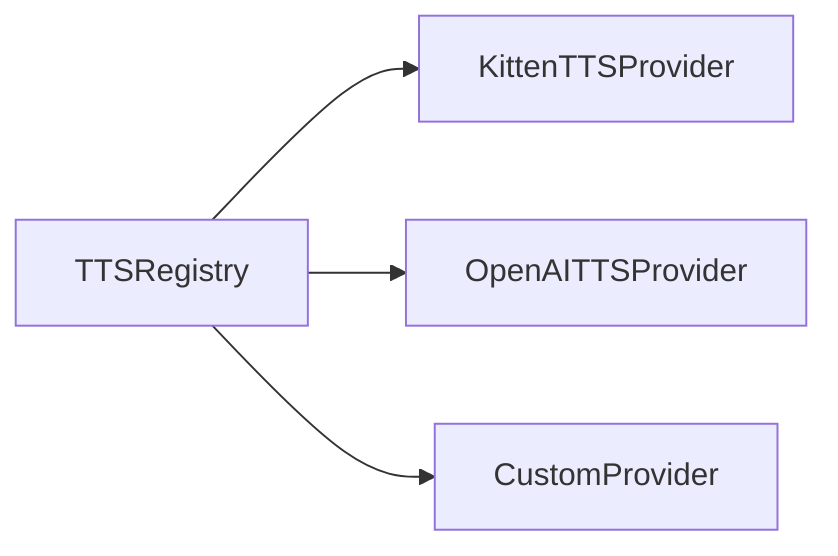

# 🎬 Studio System Documentation

Welcome to the **Synchronized Animation Engine**. This system moves beyond simple script execution to a time-aware "Studio System" where narration, animation, and subtitles are perfectly aligned.

---

## 🚀 How to Use the Studio System

The core workflow follows a deterministic pipeline:

### 1. Define a Narration Script
Instead of a single block of text, create a `NarrationScript` composed of multiple `NarrationSegment` objects.

```typescript
const script: NarrationScript = {
  segments: [
    {
      id: "intro",
      text: "Welcome to our lesson on Calculus.",
      voice: "Jasper",
      speed: 1.0
    },
    {
      id: "concept",
      text: "The derivative measures the instantaneous rate of change.",
      voice: "Luna",
      speed: 0.95
    }
  ]
};
```

### 2. Build the Timeline
Use `buildTimeline` to calculate start and end times for every segment. This uses a word-count-based duration estimation (or a `durationHint` if provided).

```typescript
import { buildTimeline } from "./tts/timeline.js";

const timeline = buildTimeline(script);
// Results in TimedSegment[] with startTime and endTime (in seconds)
```

### 3. Generate Audio & Subtitles
Generate the audio files for each segment and the corresponding SRT subtitle file.

```typescript
import { generateAudio, saveSubtitles } from "./tts/timeline.js";
import { createTTS } from "./tts/index.js";

const tts = createTTS();

// Generates individual .wav files in ./workspace
await generateAudio(tts, script, timeline);

// Saves ./workspace/subtitles.srt
saveSubtitles(timeline);
```

### 4. FFmpeg Merge
Finally, use FFmpeg to combine your Manim video with the generated audio.

```bash
ffmpeg -i video.mp4 -i audio.wav -c:v copy -c:a aac -shortest final.mp4
```

---

## 🧠 How the TTS Registry Works

The `TTSRegistry` is a central hub for all voice synthesis engines. It allows the system to remain decoupled from specific TTS implementations.

- **Storage**: It uses a `Map<string, TTSProvider>` where the key is the provider name (e.g., `"kitten"`).
- **Access**: You can retrieve a provider using `tts.get("name")`.

### Registry Architecture



---

## 🛠️ How to Add New Models/Providers

To add a new TTS engine (like OpenAI, ElevenLabs, or a local model), follow these steps:

### 1. Implement the `TTSProvider` Interface
Create a new class in `src/tts/providers/` that implements the `TTSProvider` interface.

```typescript
import type { TTSProvider, TTSRequest, TTSResult, NarrationSegment } from "../types.js";

export class MyNewProvider implements TTSProvider {
  name = "my-new-engine";

  async synthesize(req: TTSRequest): Promise<TTSResult> {
    // Implement your synthesis logic here
    return { success: true, outputPath: req.outputPath };
  }

  async synthesizeSegment(segment: NarrationSegment, outputPath: string): Promise<TTSResult> {
    return this.synthesize({
      text: segment.text,
      outputPath,
      voice: segment.voice,
      speed: segment.speed,
    });
  }
}
```

### 2. Register the Provider
Open `src/tts/index.ts` and register your new provider in the `createTTS` function.

```typescript
import { MyNewProvider } from "./providers/my_new_provider.js";

export function createTTS() {
  const registry = new TTSRegistry();

  registry.register(new KittenTTSProvider());
  registry.register(new MyNewProvider()); // Add this line

  return registry;
}
```

### 3. Use it in your Script
Now you can specify your new engine's name or its supported voices in your `NarrationSegment`.

---

## ⚠️ Important Notes
- **Paths**: The system defaults to saving artifacts in the `./workspace` directory.
- **Timing Drift**: The current duration estimation is a heuristic (2.5 words/sec). For perfect sync, consider providing a `durationHint` if you know the exact length of an audio clip.
